# Study Cafe Database Schema - Visual Diagram

## Complete Entity Relationship Diagram

```mermaid
erDiagram
    %% ============================================================================
    %% USER & PROFILE DOMAIN
    %% ============================================================================

    AUTH_USERS ||--|| PROFILES : "extends"
    PROFILES ||--|| USER_STATS : "has"

    AUTH_USERS {
        uuid id PK
        string email
        timestamp created_at
    }

    PROFILES {
        uuid id PK "FK to auth.users"
        string username UK
        string display_name
        string avatar_url
        text bio
        string location
        string exam_target
        date target_date
        timestamp created_at
        timestamp updated_at
    }

    USER_STATS {
        uuid user_id PK "FK to profiles"
        int total_study_minutes
        int current_streak_days
        int longest_streak_days
        int flame_points
        timestamp premium_until
        date last_study_date
        timestamp updated_at
    }

    %% ============================================================================
    %% STUDY TRACKING DOMAIN
    %% ============================================================================

    SUBJECTS ||--o{ STUDY_SESSIONS : "categorizes"
    PROFILES ||--o{ STUDY_SESSIONS : "records"
    STUDY_ROOMS ||--o{ STUDY_SESSIONS : "hosts"
    STUDY_SESSIONS ||--o{ FLAME_TRANSACTIONS : "triggers"

    SUBJECTS {
        uuid id PK
        string name
        string color
        string icon
        timestamp created_at
    }

    STUDY_SESSIONS {
        uuid id PK
        uuid user_id FK
        uuid subject_id FK
        timestamp start_time
        timestamp end_time
        int duration_minutes "auto-calculated"
        string status "in_progress|completed|cancelled"
        uuid study_room_id FK
        text notes
        timestamp created_at
        timestamp updated_at
    }

    PROFILES ||--o{ STUDY_ROOMS : "creates"
    STUDY_ROOMS ||--o{ STUDY_ROOM_PARTICIPANTS : "contains"
    PROFILES ||--o{ STUDY_ROOM_PARTICIPANTS : "joins"

    STUDY_ROOMS {
        uuid id PK
        string name
        text description
        uuid creator_id FK
        int max_participants "default 10"
        bool is_public
        string password_hash
        string status "active|closed"
        timestamp created_at
        timestamp updated_at
    }

    STUDY_ROOM_PARTICIPANTS {
        uuid id PK
        uuid room_id FK
        uuid user_id FK
        timestamp joined_at
        timestamp left_at
        string current_status "studying|short-break|long-break|idle"
        string current_subject
        int current_study_time_minutes
    }

    %% ============================================================================
    %% RANKING DOMAIN
    %% ============================================================================

    PROFILES ||--o{ DAILY_RANKINGS : "ranked_in"
    PROFILES ||--o{ WEEKLY_RANKINGS : "ranked_in"
    PROFILES ||--o{ MONTHLY_RANKINGS : "ranked_in"
    PROFILES ||--o{ EXAM_RANKINGS : "ranked_in"

    DAILY_RANKINGS {
        uuid id PK
        uuid user_id FK
        date date UK
        int study_minutes
        int rank "calculated"
        timestamp created_at
    }

    WEEKLY_RANKINGS {
        uuid id PK
        uuid user_id FK
        date week_start_date UK
        int study_minutes
        int rank
        timestamp created_at
    }

    MONTHLY_RANKINGS {
        uuid id PK
        uuid user_id FK
        int year UK
        int month UK
        int study_minutes
        int rank
        timestamp created_at
    }

    EXAM_RANKINGS {
        uuid id PK
        uuid user_id FK
        string exam_type UK "수능|TOEIC|공무원"
        int study_minutes
        int rank
        timestamp updated_at
    }

    %% ============================================================================
    %% COMMUNITY DOMAIN
    %% ============================================================================

    PROFILES ||--o{ COMMUNITY_POSTS : "creates"
    COMMUNITY_POSTS ||--o{ POST_LIKES : "receives"
    COMMUNITY_POSTS ||--o{ POST_COMMENTS : "receives"
    COMMUNITY_POSTS ||--o{ POST_SHARES : "receives"
    PROFILES ||--o{ POST_LIKES : "gives"
    PROFILES ||--o{ POST_COMMENTS : "writes"
    PROFILES ||--o{ POST_SHARES : "shares"

    COMMUNITY_POSTS {
        uuid id PK
        uuid user_id FK
        text content
        string post_type "general|achievement|tip|meme"
        array image_urls
        string badge_type
        int likes_count "auto-updated"
        int comments_count "auto-updated"
        int shares_count "auto-updated"
        timestamp created_at
        timestamp updated_at
    }

    POST_LIKES {
        uuid id PK
        uuid post_id FK
        uuid user_id FK
        timestamp created_at
    }

    POST_COMMENTS {
        uuid id PK
        uuid post_id FK
        uuid user_id FK
        text content
        timestamp created_at
        timestamp updated_at
    }

    POST_SHARES {
        uuid id PK
        uuid post_id FK
        uuid user_id FK
        timestamp created_at
    }

    PROFILES ||--o{ FRIENDSHIPS : "initiates"
    PROFILES ||--o{ FRIENDSHIPS : "receives"

    FRIENDSHIPS {
        uuid id PK
        uuid user_id FK
        uuid friend_id FK
        string status "pending|accepted|blocked"
        timestamp requested_at
        timestamp accepted_at
    }

    %% ============================================================================
    %% ACHIEVEMENTS DOMAIN
    %% ============================================================================

    ACHIEVEMENT_DEFINITIONS ||--o{ USER_ACHIEVEMENTS : "unlocked_as"
    PROFILES ||--o{ USER_ACHIEVEMENTS : "earns"

    ACHIEVEMENT_DEFINITIONS {
        uuid id PK
        string name UK
        text description
        string icon
        string badge_color
        string requirement_type "total_hours|streak|ranking"
        int requirement_value
        int flame_points_reward
        timestamp created_at
    }

    USER_ACHIEVEMENTS {
        uuid id PK
        uuid user_id FK
        uuid achievement_id FK
        timestamp unlocked_at
    }

    %% ============================================================================
    %% STORE & MONETIZATION DOMAIN
    %% ============================================================================

    PROFILES ||--o{ FLAME_TRANSACTIONS : "has"
    PROFILES ||--o{ PREMIUM_SUBSCRIPTIONS : "subscribes"

    FLAME_TRANSACTIONS {
        uuid id PK
        uuid user_id FK
        int amount "positive=earned, negative=spent"
        string transaction_type "study_reward|purchase|package_buy"
        uuid reference_id
        text description
        timestamp created_at
    }

    PREMIUM_SUBSCRIPTIONS {
        uuid id PK
        uuid user_id FK
        string plan_type "monthly|yearly"
        timestamp start_date
        timestamp end_date
        string status "active|cancelled|expired"
        string payment_id
        timestamp created_at
    }

    PROFILES ||--o{ STUDY_NOTES : "creates"
    SUBJECTS ||--o{ STUDY_NOTES : "categorizes"
    STUDY_NOTES ||--o{ STUDY_NOTE_PURCHASES : "purchased_as"
    STUDY_NOTES ||--o{ STUDY_NOTE_RATINGS : "rated_by"
    PROFILES ||--o{ STUDY_NOTE_PURCHASES : "purchases"
    PROFILES ||--o{ STUDY_NOTE_RATINGS : "rates"

    STUDY_NOTES {
        uuid id PK
        uuid creator_id FK
        string title
        text description
        uuid subject_id FK
        string cover_image_url
        string file_url
        string preview_url
        int price_krw
        int price_flame_points
        decimal rating "auto-calculated"
        int sales_count "auto-updated"
        string status "active|inactive|pending_review"
        timestamp created_at
        timestamp updated_at
    }

    STUDY_NOTE_PURCHASES {
        uuid id PK
        uuid user_id FK
        uuid note_id FK
        string payment_method "cash|flame_points"
        int amount_paid
        timestamp purchased_at
    }

    STUDY_NOTE_RATINGS {
        uuid id PK
        uuid user_id FK
        uuid note_id FK
        int rating "1-5"
        text review
        timestamp created_at
    }

    THEMES ||--o{ USER_THEMES : "purchased_as"
    PROFILES ||--o{ USER_THEMES : "owns"

    THEMES {
        uuid id PK
        string name
        text description
        string preview_image_url
        jsonb css_variables
        int price_krw
        int price_flame_points
        bool is_premium_only
        timestamp created_at
    }

    USER_THEMES {
        uuid id PK
        uuid user_id FK
        uuid theme_id FK
        bool is_active
        timestamp purchased_at
    }
```

## Domain-Specific Diagrams

### 1. Study Tracking Flow

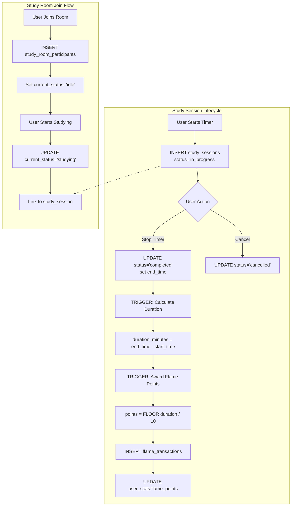

### 2. Community Interaction Flow

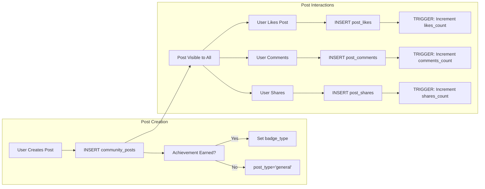

### 3. Ranking System Architecture

```mermaid
graph TB
    subgraph "Daily Ranking Calculation (Scheduled)"
        A[Midnight KST] --> B[Calculate Yesterday's Study Time]
        B --> C[SUM duration_minutes<br/>GROUP BY user_id]
        C --> D[INSERT INTO daily_rankings]
        D --> E[Calculate Rank<br/>ORDER BY study_minutes DESC]
        E --> F[UPDATE rank column]
    end

    subgraph "Weekly Ranking"
        G[Monday 00:00 KST] --> H[Calculate Last Week's Total]
        H --> I[INSERT INTO weekly_rankings]
        I --> J[Calculate Rank]
    end

    subgraph "Monthly Ranking"
        K[1st of Month] --> L[Calculate Last Month's Total]
        L --> M[INSERT INTO monthly_rankings]
        M --> N[Calculate Rank]
    end

    subgraph "Exam Ranking (Real-time)"
        O[Study Session Complete] --> P[Filter by exam_target]
        P --> Q[UPSERT exam_rankings]
        Q --> R[Recalculate Rank]
    end
```

### 4. Flame Points Economy

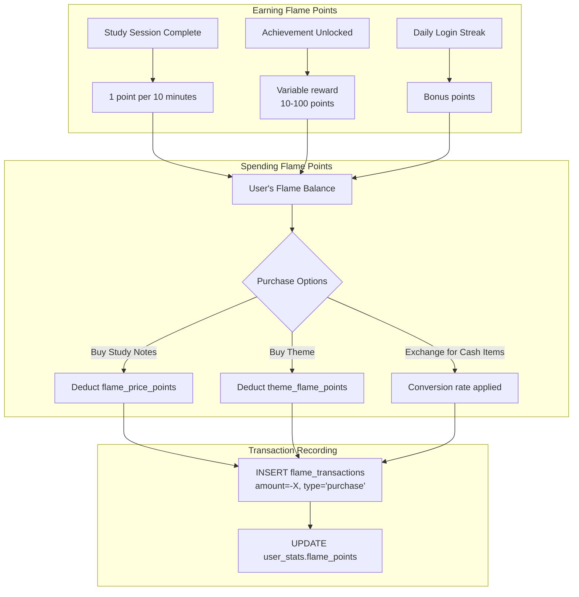

### 5. Achievement System

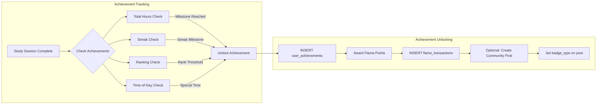

### 6. Store & Marketplace Flow

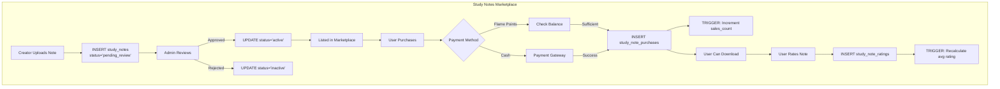

## Table Statistics

### Table Sizes & Growth Estimates

| Table | Priority | Est. Rows (1 year, 10k users) | Growth Rate |
|-------|----------|-------------------------------|-------------|
| profiles | High | 10,000 | Steady |
| user_stats | High | 10,000 | Steady |
| study_sessions | Critical | 3,650,000 | High (365/user/year) |
| community_posts | Medium | 100,000 | Medium (10/user/year) |
| post_likes | Medium | 500,000 | High |
| daily_rankings | High | 3,650,000 | Linear (365 days × users) |
| flame_transactions | Medium | 4,000,000 | High |
| study_notes | Low | 1,000 | Low |

### Index Strategy by Query Pattern

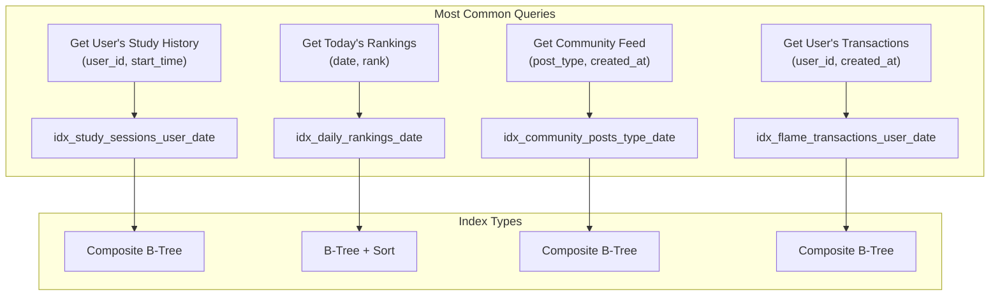

## Security Model (RLS)

### Row Level Security Policies

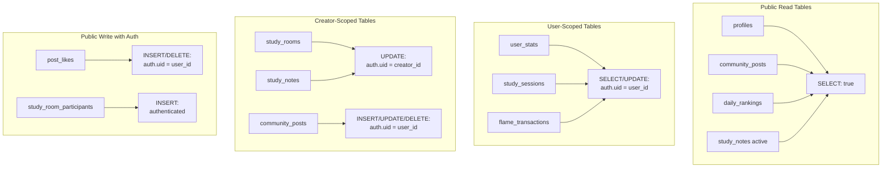

## Performance Optimization Strategy

### Query Optimization Layers

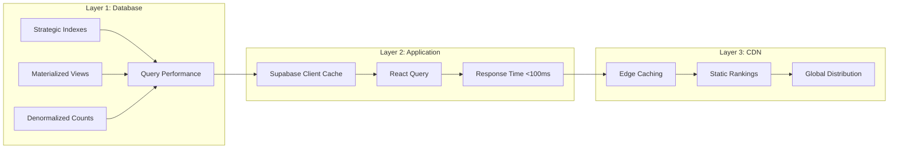

## Data Flow Summary

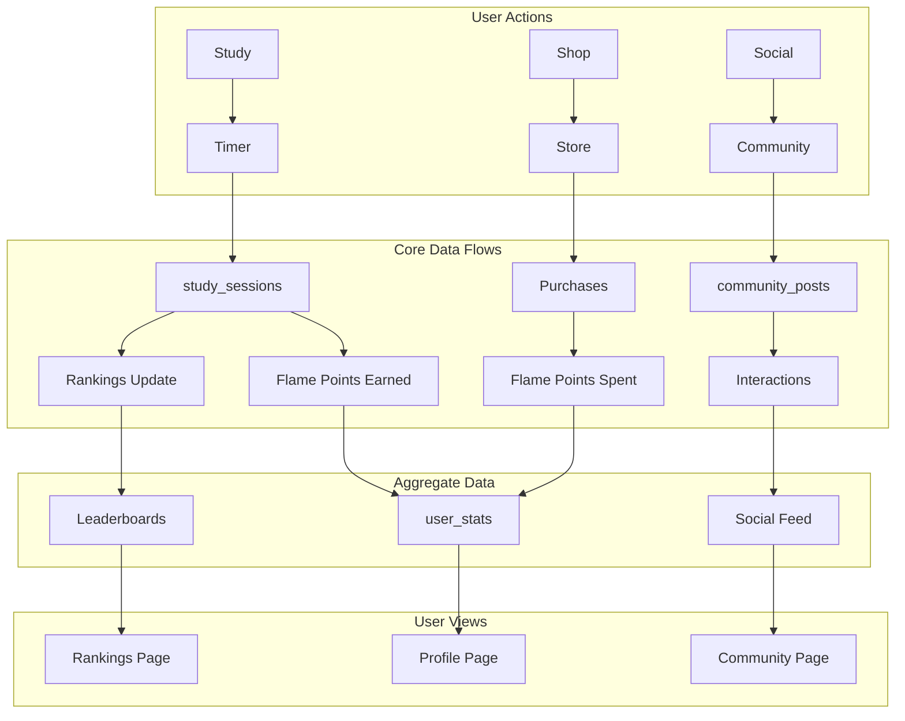

---

**Legend:**
- `PK` = Primary Key
- `FK` = Foreign Key
- `UK` = Unique Key
- Solid lines = Direct relationships
- Dashed lines = Trigger/Calculated relationships
- Subgraphs = Logical domains

